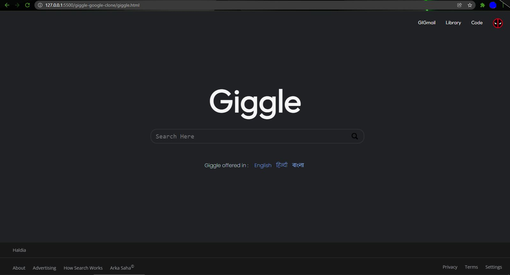
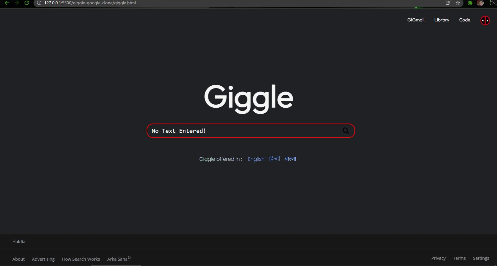
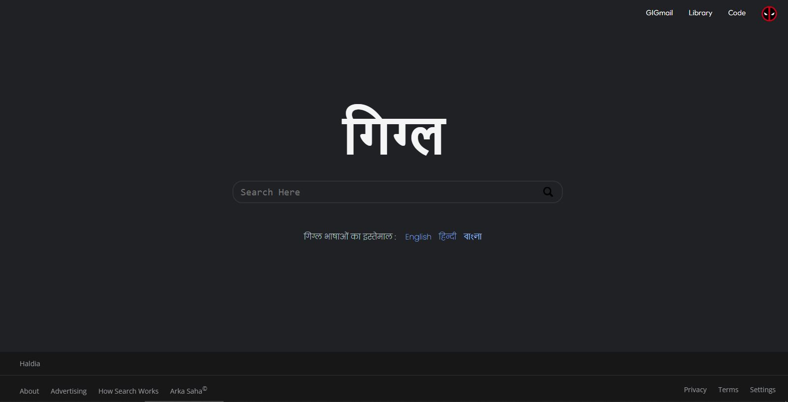

# Giggle - A Google Browser Clone 
## Web Development Project by Arka Saha

 

*This is a simple weekend project, created using HTML5, CSS and JS. Full Frontend and simplified Backend has been used to make this project easily understandable and accessible!*

  

## ``Some Screenshots of this marvy project :``

## 1) Giggle Browser Page
  
  
## 2) When Search is clicked with no query written
  
  
## 3) Hindi Mode (Other Compatible Languages, including Bengali)
  
